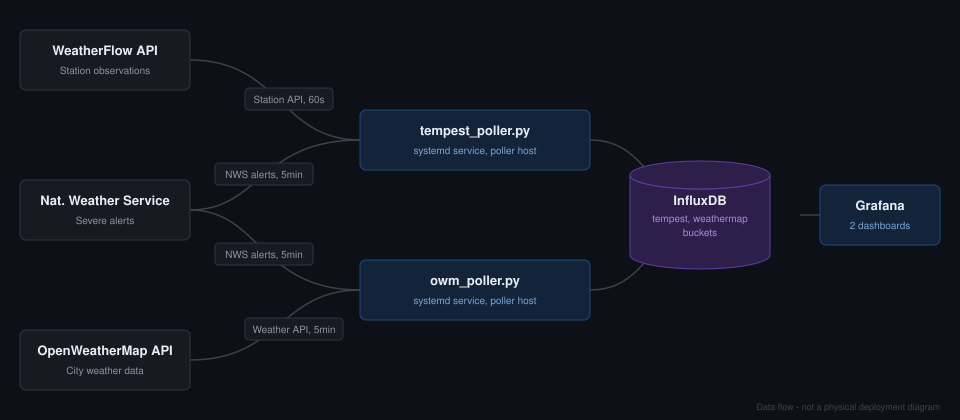
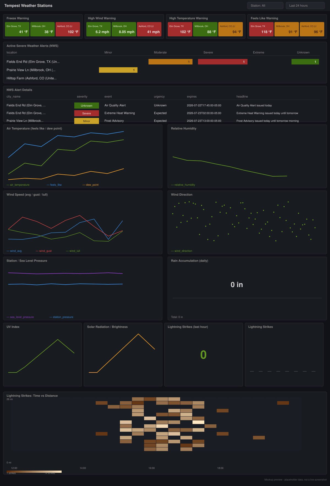
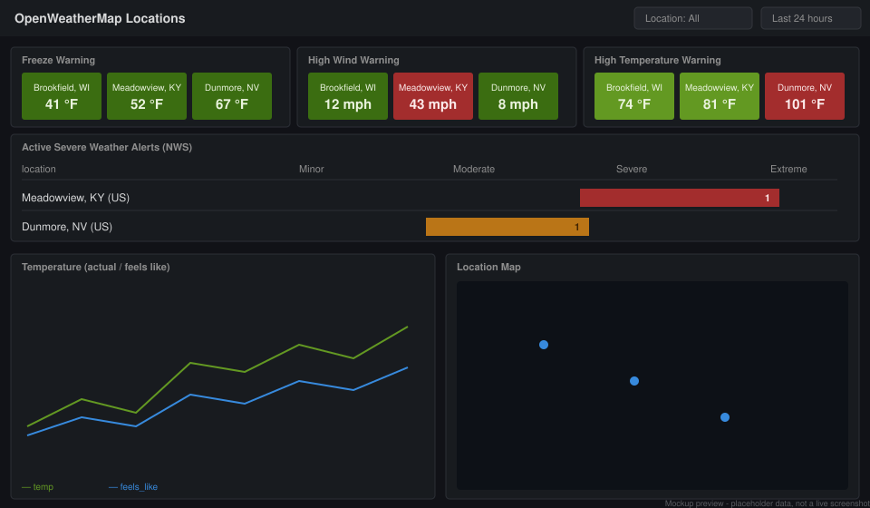

# Weather Monitoring Stack

Two independent data pipelines feeding a shared InfluxDB instance and Grafana:

- **Tempest** — polls your own WeatherFlow Tempest station(s) directly
- **OpenWeatherMap** — polls current conditions for arbitrary cities

Both pipelines also independently check the National Weather Service for
active severe weather alerts at their respective locations.

## Architecture

This shows the data flow, not physical hosts — each poller independently
calls its own weather API plus NWS for alerts, and both write into the same
InfluxDB instance under separate buckets (`tempest`, `weathermap`), which
Grafana queries to render its dashboards.

- **NWS alerts are polled by both pollers independently**, each on its own
  5-minute cycle, rather than as a shared/deduplicated service.
- **Where things actually run**: the two pollers and InfluxDB can live on
  one host or be split across multiple; Grafana can be the same host or a
  separate one. This repo doesn't assume a specific physical layout —
  see `SETUP-TEMPEST.md` / `SETUP-OWM.md` for what each piece actually needs.

## Recommended versions

- **OS**: Linux with systemd (Ubuntu/Debian recommended) for the poller hosts
- **InfluxDB**: 2.x
- **Grafana**: 8+ (needs the InfluxDB Flux data source)

See `SETUP-TEMPEST.md` / `SETUP-OWM.md` for full system requirements.

## Dashboard previews

Mockups showing the general layout and styling — not live screenshots.
All location names, coordinates, and readings shown are fabricated
placeholder data.

**Tempest dashboard**

**OpenWeatherMap dashboard**

## Setup guides

- [`SETUP-TEMPEST.md`](SETUP-TEMPEST.md) — Tempest poller, InfluxDB, and the Tempest Grafana dashboard
- [`SETUP-OWM.md`](SETUP-OWM.md) — OpenWeatherMap poller and its Grafana dashboard

## Files

| File | Purpose |
|---|---|
| `tempest_poller.py` | Polls WeatherFlow Tempest station(s) → InfluxDB |
| `tempest-poller.env.example` | Config template for the Tempest poller |
| `tempest-poller.service` | systemd unit for the Tempest poller |
| `tempest_dashboard.json` | Grafana dashboard for Tempest data |
| `owm_poller.py` | Polls OpenWeatherMap for configured cities → InfluxDB |
| `owm-poller.env.example` | Config template for the OpenWeatherMap poller |
| `owm-poller.service` | systemd unit for the OpenWeatherMap poller |
| `owm_dashboard.json` | Grafana dashboard for OpenWeatherMap data |
| `requirements.txt` | Shared Python dependencies for both pollers |
| `deployment-architecture.svg` | Architecture diagram (this README) |
| `tempest-dashboard-preview.svg` | Tempest dashboard mockup (this README) |
| `owm-dashboard-preview.svg` | OpenWeatherMap dashboard mockup (this README) |
